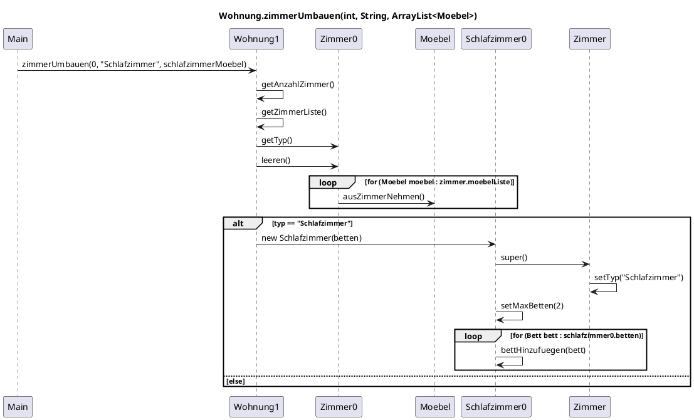

# Sequenzdiagramm

```plantuml
@startuml
title Wohnung.zimmerUmbauen(int, String, ArrayList<Moebel>)

participant Main
participant Wohnung1
participant Zimmer0
participant Moebel
participant Schlafzimmer0

Main -> Wohnung1 : zimmerUmbauen(0, "Schlafzimmer", schlafzimmerMoebel)
/'schlafzimmerMoebel = [Bett bett1, Bett bett2, Moebel spiegel]'/
Wohnung1 -> Wohnung1 : getAnzahlZimmer()
Wohnung1 -> Wohnung1 : getZimmerListe()
Wohnung1 -> Zimmer0 : getTyp()
Wohnung1 -> Zimmer0 : leeren()
loop for (Moebel moebel : zimmer.moebelListe)
    Zimmer0 -> Moebel : ausZimmerNehmen()
end
alt typ == "Schlafzimmer"
Wohnung1 -> Schlafzimmer0 : new Schlafzimmer(betten)
Schlafzimmer0 -> Zimmer : super()
Zimmer -> Zimmer : setTyp("Schlafzimmer")
Schlafzimmer0 -> Schlafzimmer0 : setMaxBetten(2)
loop for (Bett bett : schlafzimmer0.betten)
Schlafzimmer0 -> Schlafzimmer0 : bettHinzufuegen(bett)
end
else 
else else
end

@enduml
```